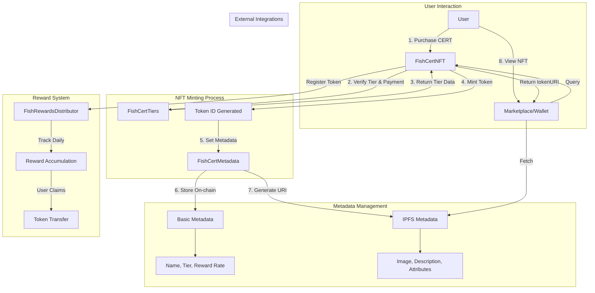

# FISH CERT NFT Smart Contract Architecture

## Overview
The FISH CERT NFT system consists of multiple interconnected smart contracts that handle the minting, reward distribution, and metadata management for climate-aligned digital certificates.

## Smart Contract Components

### 1. **FishCertNFT.sol** (Main NFT Contract)
- **Purpose**: ERC-721 compliant NFT contract for FISH CERTs
- **Key Functions**:
  - `mint(address to, uint256 tier)` - Mints new CERT based on tier
  - `tokenURI(uint256 tokenId)` - Returns metadata URI
  - `getTierInfo(uint256 tokenId)` - Returns tier-specific information
  - `transferFrom()` - Handles NFT transfers with reward updates

### 2. **FishRewardsDistributor.sol** (Reward Distribution)
- **Purpose**: Manages daily reward distribution over 10 years
- **Key Functions**:
  - `claimRewards(uint256 tokenId)` - Claims accumulated rewards
  - `calculateRewards(uint256 tokenId)` - Calculates pending rewards
  - `updateRewardBalance()` - Updates reward pool
  - `getRewardRate(uint256 tier)` - Returns tier-specific reward rate

### 3. **FishCertTiers.sol** (Tier Management)
- **Purpose**: Manages tier configurations and pricing
- **Tier Structure**:
  ```solidity
  struct Tier {
      string name;
      uint256 rewardRate; // in basis points (50% = 5000)
      uint256 price;
      uint256 maxSupply;
      uint256 currentSupply;
      bool isActive;
  }
  ```

### 4. **FishCertMetadata.sol** (Metadata Storage)
- **Purpose**: On-chain metadata management
- **Key Functions**:
  - `setTokenMetadata(uint256 tokenId, Metadata memory data)`
  - `updateAttribute(uint256 tokenId, string key, string value)`
  - `getFullMetadata(uint256 tokenId)`

### 5. **FishCertGovernance.sol** (DAO Governance)
- **Purpose**: Manages governance rights for higher tiers
- **Features**:
  - Voting power based on tier level
  - Proposal creation for Reef Bounty+
  - Treasury management

## Metadata Flow Diagram



## Metadata Structure

### On-Chain Metadata
```json
{
  "tokenId": 1234,
  "tier": 3,
  "mintTimestamp": 1672531200,
  "originalOwner": "0x...",
  "rewardsClaimed": 125000000,
  "lastClaimTimestamp": 1673740800
}
```

### Off-Chain Metadata (IPFS)
```json
{
  "name": "FISH CERT - Reef Bounty #1234",
  "description": "Premium FISH Certificate...",
  "image": "ipfs://Qm.../reef-bounty.png",
  "attributes": [...],
  "properties": {...}
}
```

## Key Workflows

### 1. Minting Flow
1. User selects tier and initiates purchase
2. Contract verifies payment amount matches tier price
3. Contract checks tier availability (maxSupply)
4. NFT is minted with unique token ID
5. Metadata is set (both on-chain and IPFS reference)
6. Reward tracking is initialized
7. NFT is transferred to user

### 2. Reward Distribution Flow
1. Daily reward calculation based on:
   - Token tier (50%-200% rate)
   - Days since mint (max 3,650 days)
   - Previous claims
2. User can claim accumulated rewards anytime
3. Rewards are transferred in FISH tokens
4. Claim timestamp is updated

### 3. Metadata Update Flow
1. Certain metadata can be updated by contract owner:
   - Environmental impact metrics
   - Status (Active/Paused)
   - External URLs
2. Core attributes are immutable:
   - Tier level
   - Reward rate
   - Token ID
   - Mint timestamp

### 4. Transfer Flow
1. Standard ERC-721 transfer initiated
2. Contract updates reward claim status
3. Pending rewards are calculated and stored
4. New owner can claim from transfer point
5. Governance rights (if applicable) are transferred

## Security Considerations

1. **Access Control**
   - Role-based permissions (Owner, Admin, User)
   - Tier-specific function access
   - Emergency pause mechanism

2. **Reward Security**
   - Reentrancy guards on claims
   - Overflow protection
   - Time-based claim limits

3. **Metadata Integrity**
   - IPFS pinning for permanence
   - On-chain backup of critical data
   - Versioning for updates

## Gas Optimization

1. **Batch Operations**
   - Batch minting for reduced gas
   - Grouped reward claims
   - Efficient storage patterns

2. **Storage Optimization**
   - Packed structs
   - Minimal on-chain data
   - IPFS for heavy metadata

## Integration Points

1. **Frontend dApp**
   - Web3 wallet connection
   - Tier selection interface
   - Reward dashboard
   - Metadata display

2. **Backend Services**
   - IPFS pinning service
   - Metadata generation
   - Analytics tracking
   - Price oracle integration

3. **Third-party Platforms**
   - OpenSea compatibility
   - Wallet metadata support
   - DeFi protocol integration

## Future Enhancements

1. **Dynamic NFTs**
   - Evolving artwork based on impact
   - Achievement unlocks
   - Milestone celebrations

2. **Cross-chain Compatibility**
   - Bridge to other chains
   - Multi-chain reward distribution
   - Unified governance

3. **Enhanced Governance**
   - Proposal templates
   - Quadratic voting
   - Treasury diversification

4. **Impact Verification**
   - Oracle integration for real-world data
   - Carbon credit verification
   - Impact NFT certificates